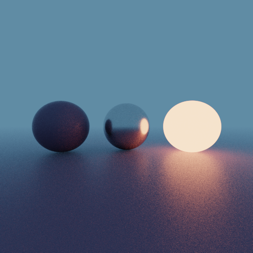

# rays



A toy path tracer, written in C.

No way (other than changing the source) to load scenes, or choose any settings. It produces the same image every time.

WIP.

# Build

```shell
cd src
make
```

this will generate an executable in the `bin` directory.
